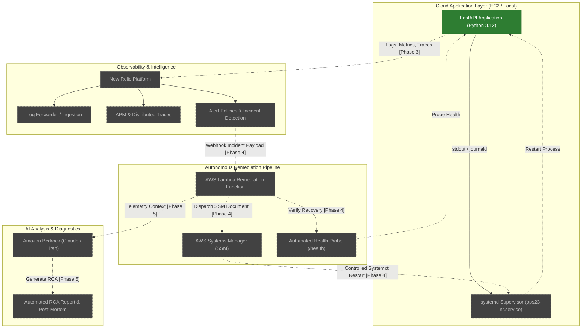

# Ops23-NR System Architecture

**Ops23-NR — Intelligent Cloud Observability & Self-Healing Platform**

---

## 1. Executive Summary & Architectural Vision

Ops23-NR is an autonomous cloud observability, incident detection, and self-healing platform. The system bridges application performance monitoring (APM), structured telemetry, serverless remediation, and generative AI root cause analysis into a continuous operational loop.

The core operational feedback loop operates across 6 distinct stages:

```
[ Application (FastAPI on EC2) ]
               │
               ▼ Telemetry (Logs, Metrics, Traces)
[ Observability Engine (New Relic) ]
               │
               ▼ Alert Notification (Webhook)
[ Orchestrator (AWS Lambda) ]
               │
               ▼ Run Command
[ Node Agent (AWS Systems Manager) ]
               │
               ▼ Self-Healing Action (systemctl restart ops23-nr)
[ Node / Application Layer ]
               │
               ▼ Automated Verification (GET /health)
[ Health Verification Loop ]
               │
               ▼ In-depth Diagnostics
[ AI Root Cause Analysis (Amazon Bedrock) ]
```

---

## 2. Architecture Diagram



---

## 3. Component Breakdown & Implementation Status

| Component | Technology | Responsibility | Current Status |
| :--- | :--- | :--- | :--- |
| **FastAPI Core Engine** | Python 3.12, FastAPI, Pydantic v2 | High-performance REST API with structured logging middleware, health endpoint, simulated datasets, and controlled failure endpoints. | **IMPLEMENTED** (Phase 1) |
| **Structured JSON Logging** | Python `logging`, `contextvars` | Emits single-line JSON with timestamps, correlation request IDs, endpoints, latency, status codes, and sensitive data masking. | **IMPLEMENTED** (Phase 1) |
| **Controlled Failure Simulation** | FastAPI routes (`/api/simulate/*`) | Controlled HTTP 500 error generation and guarded process crash simulation for supervisor testing. | **IMPLEMENTED** (Phase 1) |
| **Automated Test Suite** | Pytest, HTTPX | Verifies API contracts, status codes, structured logging metadata, and safe non-terminating crash tests. | **IMPLEMENTED** (Phase 1) |
| **EC2 & Host Infrastructure** | AWS EC2 (Amazon Linux 2023 / Ubuntu) | Host operating environment for the FastAPI service. | **NOT IMPLEMENTED** (Phase 2) |
| **Systemd Service Supervisor** | Linux `systemd` | Manages process lifecycle with `Restart=always` and `RestartSec=3s`. | **NOT IMPLEMENTED** (Phase 2) |
| **Terraform IaC** | HashiCorp Terraform | Infrastructure provisioning for EC2 instances, security groups, IAM roles, and SSM policies. | **NOT IMPLEMENTED** (Phase 2) |
| **New Relic APM & Logs** | New Relic Python Agent, Infrastructure Agent | Collects distributed traces, transactions, golden signals, and forwards structured JSON logs. | **NOT IMPLEMENTED** (Phase 3) |
| **New Relic Incident Detection** | New Relic Alert Policies | Evaluates error rates (>5%) and availability checks to fire incident webhooks. | **NOT IMPLEMENTED** (Phase 3) |
| **AWS Lambda Remediation** | AWS Lambda (Python 3.12) | Consumes New Relic webhook alerts and triggers SSM Run Command for automated repair. | **NOT IMPLEMENTED** (Phase 4) |
| **AWS Systems Manager (SSM)** | AWS Systems Manager Run Command | Executes controlled remediation scripts (`systemctl restart ops23-nr`) without SSH access. | **NOT IMPLEMENTED** (Phase 4) |
| **Post-Remediation Verification** | Lambda HTTP Client | Probes `GET /health` after SSM execution to verify healthy recovery. | **NOT IMPLEMENTED** (Phase 4) |
| **Amazon Bedrock AI RCA** | Amazon Bedrock (Foundation Models) | Synthesizes error logs, telemetry traces, and metrics to produce automated root cause analysis. | **NOT IMPLEMENTED** (Phase 5) |

---

## 4. Phase-by-Phase Roadmap

### Phase 1: Application Foundation (**CURRENT PHASE - COMPLETE**)
- Lightweight, production-grade FastAPI application.
- Standardized structured JSON logging with context-bound `request_id`.
- Controlled error endpoint (`POST /api/simulate/error`) generating HTTP 500 and ERROR log.
- Controlled crash endpoint (`POST /api/simulate/crash`) with multi-layered safety guards.
- Comprehensive Pytest test suite ensuring 100% test isolation.
- Zero external cloud dependencies, zero credentials, and no hardcoded secrets.

### Phase 2: Host Infrastructure & Process Supervision (**NOT IMPLEMENTED**)
- Terraform definitions for AWS EC2 instance provisioning.
- `ops23-nr.service` systemd unit configuration with automatic restart policies.
- System journal integration routing application stdout to system logs.

### Phase 3: New Relic Observability Integration (**NOT IMPLEMENTED**)
- New Relic Python APM integration (`newrelic-admin`).
- Distributed tracing across endpoints.
- Log parsing rules for structured JSON fields (`request_id`, `duration`, `http_status_code`).
- Golden signals dashboard (Latency, Traffic, Errors, Saturation).
- Alert condition: Error rate spike > 5% over 5-minute rolling window.

### Phase 4: Autonomous Remediation with AWS Lambda & SSM (**NOT IMPLEMENTED**)
- Webhook bridge between New Relic Alerts and AWS Lambda.
- IAM role configuration granting least-privilege SSM execution.
- SSM document to trigger graceful service restart.
- Automated health check verification polling `/health`.

### Phase 5: Generative AI Root Cause Analysis (**NOT IMPLEMENTED**)
- Integration with Amazon Bedrock API.
- Prompt engineering combining failure stack trace, recent logs, and APM metrics.
- Incident report generation and recommendations for engineering teams.
